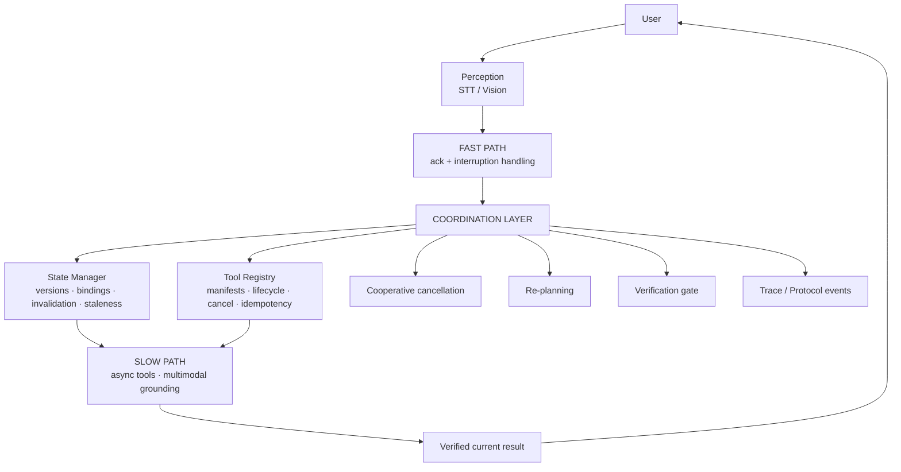

# AURA — Interruptible Real-Time Agent

**Intelligence that adapts to your latest intent.**

AURA is an interruptible real-time execution architecture that keeps an AI agent responsive when the user changes their mind mid-task — cancelling obsolete work, versioning state, rejecting stale results, and re-planning around the newest intent.

> **Theme 05 — Interruptible Real-Time Agents** · Samsung PRISM Generative AI Hackathon 2026–27
> **Team: MSRIT_An Apple a Day** · MS Ramaiah Institute of Technology

## 🔗 Project Links

🌐 **Website:** [AURA Live Website](https://interruptible-real-time-agent.vercel.app/)

🎥 **Demo Video:** [Watch the AURA Demo](https://drive.google.com/drive/folders/1Ennxgx2lOPFOWgUtt2lR1oPX80RuxKdR?usp=drive_link)

💻 **GitHub Repository:** [Interruptible-RealTime-Agent](https://github.com/udbhavshukla/Interruptible-RealTime-Agent)
> **Prototype status (read before evaluating).** The runnable prototype in this tree is the **React frontend** (`frontend/`) with a deterministic in-browser execution simulator that faithfully plays the versioned interrupt/cancel/stale-rejection protocol. The Python backend modules (`src/state`, `src/tools`, `src/multimodal`, `src/protocol`) were implemented during development — verified via in-tree bytecode remnants and a recorded 110-test pytest manifest with zero failures — but their **source files are not present in the current tree**, so backend tests cannot be re-run here until sources are restored. Sections 6–10 below describe those contracts as designed and previously implemented; anything not verifiable in-tree is marked **[VERIFY]**.

---

## 1. The Problem

Traditional agent execution breaks when a task is already running and the user speaks up:

1. The user interrupts while a tool is running.
2. The user changes a parameter (e.g. destination).
3. An old asynchronous result arrives late and overwrites new state.
4. Multiple overlapping operations race each other.
5. A retried state-changing action executes twice.
6. Raw perception (speech/vision guesses) is mistaken for authoritative state.

Concrete failure:

> User: “Find a flight from Bangalore to Delhi.”
> Agent starts searching…
> User: “Actually Mumbai, not Delhi.”

Without protection, the old Delhi operation keeps running, returns later, and its stale result overwrites the current Mumbai intent — the user sees yesterday's answer to today's question. **AURA exists to make that failure structurally impossible.**

## 2. The AURA Solution

AURA treats **interruption as a first-class execution event**, not an edge case:

```
USER
 ↓
FAST ACK            (immediate acknowledgement, ~100 ms class)
 ↓
ASYNC EXECUTION     (slow path: tools run without blocking conversation)
 ↓
INTERRUPTION        (new intent arrives mid-flight)
 ↓
CANCEL / INVALIDATE (obsolete work cancelled; its version binding revoked)
 ↓
STATE UPDATE        (localized correction, version advances)
 ↓
RE-PLAN             (new tool call bound to the new version)
 ↓
VERIFY              (results and perceptions checked before commit)
 ↓
CURRENT RESULT      (only the latest intent is ever rendered)
```

Core guarantee: **old work may still physically finish, but stale work cannot overwrite the latest authoritative state.**

## 3. Key Principles

### Latest Intent Wins
The newest user correction becomes authoritative. Corrections are localized (only the changed slot moves) and every change advances a monotonic state version.

### Perception Proposes, Verification Commits
Audio/image perception produces structured *proposals* with confidence scores. Nothing unverified becomes trusted state — low-confidence guesses trigger clarification, conflicts are surfaced, never silently resolved.

### State Is Versioned
Every tool call is bound to the state version it was planned against. Results from obsolete versions are rejected as stale; unknown or invalidated calls are rejected too.

### Cancellation Has Semantics
Cancellation is cooperative and truthful: it may prevent an effect *before* a commit boundary, but after commitment the system reports the true status and reconciles via compensating actions instead of pretending the cancellation succeeded.

### Side Effects Are Idempotent
State-changing operations carry idempotency keys (scoped per session + tool), so retries and duplicate deliveries execute the effect exactly once.

## 4. Architecture



> Status note: the coordination semantics above are implemented in the runnable frontend simulator (`frontend/src/services/MockAgentClient.ts`) and were implemented in the Python backend modules (bytecode + test-manifest evidence in-tree; sources pending restoration — **[VERIFY]**). The M2 Coordinator runtime itself is future scope.

## 5. Interruption Demo

The canonical scenario (playable in the Live Agent page, also covered by the recorded backend test suite):

1. User: “Find a flight from Bangalore to Delhi.”
2. AURA sends an immediate acknowledgement and starts async search as `call_001`, bound to the current state version.
3. User interrupts: “Actually Mumbai, not Delhi.”
4. AURA detects the interruption → cancels `call_001` → updates destination Delhi → Mumbai → advances the state version → re-plans as `call_002`.
5. Late `call_001` result arrives → bound to the old version → **STALE → REJECTED** (never rendered, never written).
6. `call_002` result arrives → bound to current version → **ACCEPTED**; Mumbai options render.

Final state: `origin = Bangalore`, `destination = Mumbai`. This matters because it is the difference between an agent that *hears* corrections and one that *honors* them.

## 6. State Management

*[VERIFY — Python sources absent from tree; contract below matches bytecode + test-manifest evidence and the runnable simulator.]*

- **Session-scoped state** — no cross-session leakage; versions are per-session counters.
- **Localized slot updates** — only listed slots change; unrelated slots are preserved.
- **Snapshots & history** — immutable snapshots per version plus append-only history for replay/audit.
- **Monotonic versions** — exactly +1 per real change; no-op writes change nothing.
- **Version-bound calls** — `register_call` binds `call_id → state_version`; `invalidate_call` revokes it (idempotent); `is_stale()` answers staleness only.

Example:

```
v0:  destination = Delhi      (call_001 bound to v0)
correction →
v1:  destination = Mumbai     (call_002 bound to v1)
```

A result bound to v0 may not overwrite authoritative v1 state.

## 7. Tool Registry

*[VERIFY — Python sources absent from tree; contract below matches bytecode + test-manifest evidence.]*

- Manifest registration, lookup, and schema validation (required keys, known kinds, commit-boundary and idempotency-policy rules).
- Asynchronous providers behind a common adapter contract; unique `call_id` per attempt.
- Lifecycle: `pending → running → completed | failed | cancelled | committed`.
- Cooperative cancellation with truthful post-commit reporting.
- Session-scoped idempotency store: repeats return the original result (`idempotent_replay`) without re-executing; failures/cancels/timeouts are never cached; concurrent same-key executions serialize so exactly one executes.

Recorded tool manifests (per development history): `flight_search`, `manual_lookup`, `barcode_lookup` (read-only); `reserve` (preparatory); `booking` (state-modifying, commit boundary); `cancel_booking` (compensating). **[VERIFY]** against restored sources before extending.

## 8. Safe Side Effects

### Idempotency
Effect identity (`session + tool + idempotency_key`) is separate from execution identity (`call_id`). Replays preserve the original result *and* its original version — they route to effect reconciliation, never through the version gate as fresh results.

### Commit Boundary
Before commitment, cooperative cancellation can prevent the effect. After commitment, cancellation reports `committed` truthfully and reconciliation uses compensating actions (e.g. `cancel_booking`) — the system never claims an undo that did not happen.

## 9. Multimodal Grounding

*[VERIFY — Python sources absent from tree; contract below matches bytecode + test-manifest evidence.]*

- **Audio** → transcript + confidence → structured proposal → verification → state update only if accepted (threshold `0.75`, per recorded implementation).
- **Image** → candidate facts + confidence → verification → state update only if accepted.
- Proposals carry the grounding-time `state_version`; stale/future-bound proposals are skipped, never applied; unverified proposals can never commit (commit point enforces `verified AND safe_to_commit`).
- Deterministic harness conventions (no external APIs/keys) for reproducible evaluation.

## 10. Protocol / Events

The frontend and the simulator speak the same event vocabulary the backend protocol defines (verified in `frontend/src/types.ts` + backend bytecode evidence):

| Event | Carries |
|---|---|
| `USER_INPUT`, `FAST_ACK`, `TOOL_STARTED` | `session_id`, `call_id`, `state_version`, tool, args |
| `INTERRUPTION`, `CANCEL_REQUESTED`, `TOOL_CANCELLED` | `call_id`, reason (`superseded_by_new_intent`) |
| `STATE_UPDATED`, `REPLAN` | `from/to` versions, slot diffs |
| `TOOL_COMPLETED`, `STALE_RESULT_REJECTED` | `call_id`, result vs current version |
| `FINAL_RESPONSE`, `CLARIFICATION`, `FILLER` | version-bound answers or versionless acks |
| `TRANSCRIPTION`, `GROUNDING` | text/facts + confidence + verified flag |

Every tool call/result carries the `(session_id, call_id, state_version)` triple, so any layer can validate freshness without trusting another layer.

## 11. Frontend

A 9-page glassmorphism control surface (React 18 + TypeScript + Vite + React Router, no UI framework) for the interruptible execution system. It visualizes authoritative events; all timings/results shown are **simulated by the mock backend**, not measured benchmarks.

| Page | What it does |
|---|---|
| Overview `/` | Brand hero, KPI cards, engine status, live recent-activity feed, demo entry card |
| Live Agent `/agent` | 3-column demo: conversation + interrupt composer, live execution stepper, versioned state card, deterministic results |
| Sessions `/sessions` | Session table (intent, status, interruptions, version) + details drawer |
| Activity `/activity` | Filterable real-time event stream with JSON inspector drawer |
| Tools `/tools` | Registry cards, schema modal, mock dry-run tester |
| Multimodal `/multimodal` | Mic waveform + transcription confidence; image drop-zone + grounding results |
| Analytics `/analytics` | Latency/interruption/recovery/stale-rejection charts (simulated data) |
| System `/system` | Service health cards + architecture flow diagram |
| Settings `/settings` | Dark/Light/System theme (persisted), appearance, connection, developer toggles |

Design system: Synthetic Lime (`#C8FF00`) accent on Bio Black (`#06110D`), full dark/light theme with persisted system-aware switching, responsive layouts, focus states, reduced-motion support.

## 12. Demo Walkthrough

1. `cd frontend && npm install && npm run dev` → open http://localhost:5173/agent?demo=1
2. Watch the Bangalore → Delhi request start (fast ack, `call_001` running).
3. After ~3 s the scripted interruption fires (“Actually Mumbai, not Delhi.”) — or type your own correction / hit **■ Interrupt**.
4. Observe: cancellation → state v1→v2 (Delhi→Mumbai) → re-plan → `call_002`.
5. Observe the late `call_001` result rejected as stale; Mumbai results render from `call_002`.

### Live Demo
[ADD FINAL DEPLOYED WEBSITE URL HERE]

## 13. Tech Stack

| Layer | Verified from |
|---|---|
| Frontend: React 18, TypeScript 5, Vite 5, React Router 6, hand-rolled SVG charts, no UI framework | `frontend/package.json` |
| Execution simulator: deterministic timers, versioned events, scripted + freeform interruption | `frontend/src/services/MockAgentClient.ts` |
| Real-backend seam: `AgentClient` interface + WebSocket stub (`ws://localhost:8000/ws`) | `frontend/src/services/{AgentClient,RealAgentClient}.ts` |
| Backend (Python): state/tools/multimodal/protocol modules + pytest suite | bytecode remnants + 110-test manifest in `.pytest_cache` — **sources absent, [VERIFY]** |
| Build/test tooling | `vite`, `tsc`, `pytest` (cache only) |

## 14. Project Structure

```
.
├── frontend/                  # Runnable React prototype (verified present)
│   ├── src/pages/             # 9 routed pages
│   ├── src/components/        # Shell (sidebar/topbar/palette) + glass UI kit
│   ├── src/services/          # AgentClient, MockAgentClient, RealAgentClient stub
│   ├── src/store/             # AuraContext (events, toasts, settings)
│   ├── src/theme/             # dark/light/system theming, persisted
│   ├── src/data/              # tool catalog, session seeds
│   ├── package.json           # scripts: dev, build, preview
│   └── vite.config.ts         # dev server :5173
├── src/                       # Python backend dirs — SOURCE FILES ABSENT (only __pycache__)
│   ├── state/ tools/ multimodal/ protocol/
├── tests/                     # Python test sources ABSENT (110-test manifest in .pytest_cache)
├── README.md
└── [no Dockerfile / compose / requirements.txt / .env / CI config present]
```

## 15. Testing & Validation

- **Frontend**: `tsc --noEmit` strict-clean and `vite build` verified passing (most recent check); served 200s on dev + preview servers.
- **Backend**: `.pytest_cache` records **110 collected tests, zero failures at last run**, across state (16+11), tools (17), idempotency races (10), multimodal (11+8), grounding-stale (4), protocol (6), replay/version contracts (4+3), cancellation/invalidation (5), dynamic tools (6), integration (5), contract (4). **Not currently runnable — test sources are absent from the tree. [VERIFY] after restoring `src/` + `tests/`.**
- No performance percentages, benchmarks, or production metrics are claimed anywhere: all UI numbers are labeled simulated mock output.

## 16. Run Locally

Frontend (verified):

```bash
cd frontend
npm install
npm run dev      # → http://localhost:5173  (demo: /agent?demo=1)
```

Backend: no runnable source, requirements file, or run command exists in the current tree. **[VERIFY]** — restore `src/` + `tests/` first; do not invent setup steps.

No `.env` file or `.env.example` is present; the frontend needs no environment variables (mock backend is default; the real-client stub points at `ws://localhost:8000/ws` when wired up).

## 17. Build

```bash
cd frontend
npm run build    # tsc --noEmit && vite build → frontend/dist/
npm run preview  # serve the production bundle locally
```

Backend tests (once sources are restored): `python -m pytest tests/ -q` (historical command per cache layout — **[VERIFY]**).

## 18. Docker / Reproducibility

No `Dockerfile`, `docker-compose.yml`/`compose.yaml`, `Makefile`, evaluation scripts, or `requirements.txt` are present in the repository. Reproducibility today = `frontend/` npm scripts above. Containerization is future scope — not claimed.

## 19. Deployment

No Vercel configuration or CI workflow exists in the repo. The frontend is a static Vite bundle (`frontend/dist/`) deployable to any static host; the intended target is a public static deployment.

> Live Website: [ADD FINAL WEBSITE URL HERE]

The Python backend is **not publicly deployed or connected** — the live UI runs against the in-browser mock backend. Do not present mock timings or mock results as production measurements.

## 20. Limitations

All verified against the current tree:

- Python backend sources absent — backend behavior is evidenced (bytecode + test manifest) but not runnable here.
- Mock/deterministic providers only — no real flights, bookings, payments, or external integrations.
- In-memory, session-scoped state — no persistence, no distributed coordination.
- No authentication, no database, no cloud infrastructure.
- Analytics/system numbers in the UI are simulated display data.
- No Docker, CI, or deployment automation in-repo.

## 21. Future Scope

Clearly *not* current functionality: restoring and wiring the Python backend over WebSocket; real tool provider integrations; persistent session storage; production-grade distributed coordination; richer multimodal models; larger evaluation scenarios; expanded compensation workflows; containerized reproducible evaluation.

## 22. Theme 05 Alignment

| Theme Objective | AURA Implementation | Evidence |
|---|---|---|
| Real-time responsiveness | Fast Path ack + Slow Path async execution | `MockAgentClient.ts`, Live Agent page |
| Interruption recovery | Cancel → invalidate → state update → re-plan | demo flow, Activity trace |
| Session slot tracking | Session-scoped state + localized correction + versions | simulator + backend contracts (§6) |
| Schema-driven tools | Registry + manifests + validation + dry-run tester | Tools page, `data/catalog.ts` |
| Multimodal grounding | Voice/vision → confidence → verification gate | Multimodal page, §9 |
| Protocol compliance | `(session_id, call_id, state_version)` on every call/result + trace | Activity page, §10 |

Backend rows rest on implementation evidence (bytecode + 110-test manifest); re-verify against restored sources before final judging claims.

## 23. Team

**MSRIT_An Apple a Day** — MS Ramaiah Institute of Technology

- Udbhav Shukla — 1ms25et058@msrit.edu
- Aditya Raj Chauhan — 1ms25ci009@msrit.edu
- Bhuma Lakshmi Hansika — 1ms25cs043@msrit.edu
- Eggonu Venkata Tejal — 1ms25ci040@msrit.edu

## 24. Links

🌐 **Website:** [ADD FINAL DEPLOYED WEBSITE URL HERE]
💻 **GitHub:** https://github.com/udbhavshukla/Interruptible-RealTime-Agent.git

## Screenshots

[ADD AURA OVERVIEW SCREENSHOT]
[ADD LIVE AGENT SCREENSHOT]
[ADD INTERRUPTION TRACE SCREENSHOT]

---
*Latest Intent Wins · Perception Proposes, Verification Commits. Prototype documentation — mock-backed where noted; backend sections pending source restoration.*
